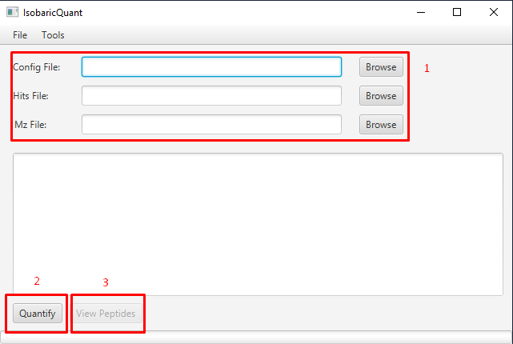
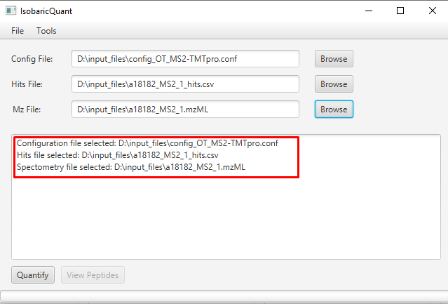
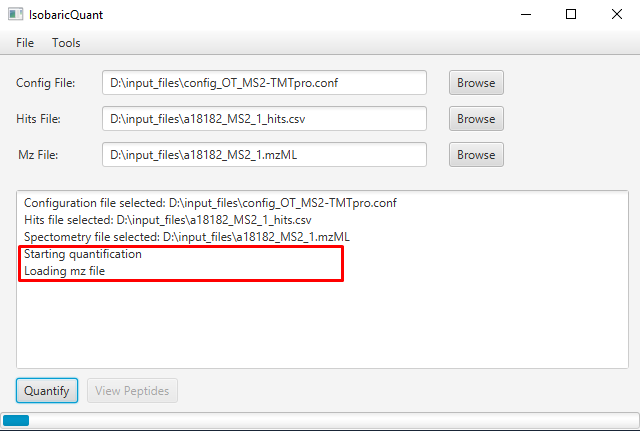
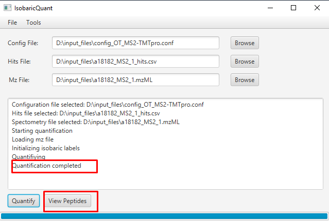
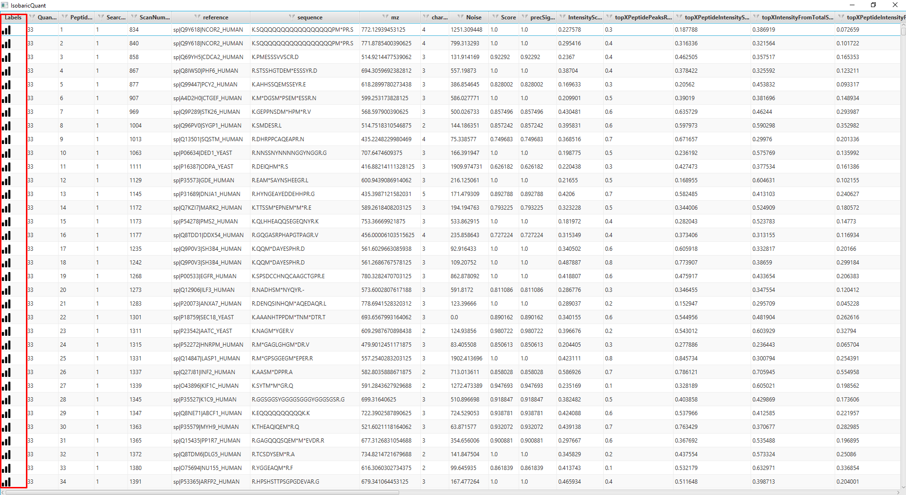
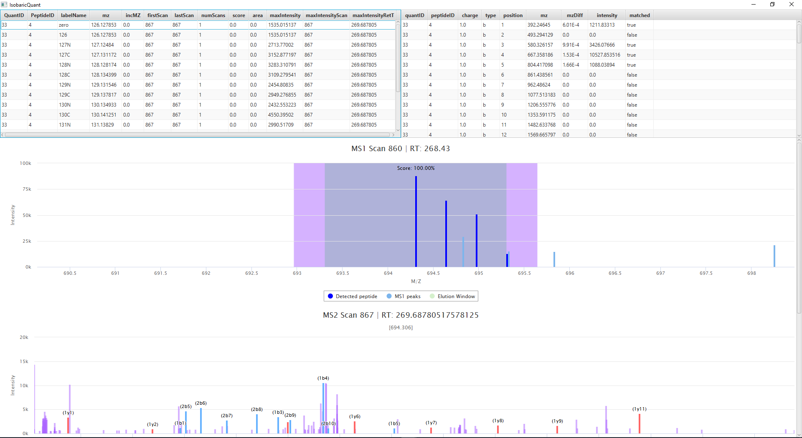
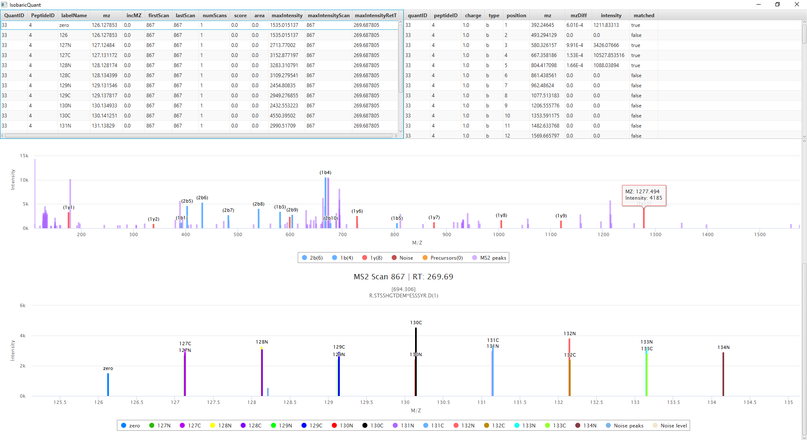

Getting started
===============

Dependencies
------------

In order to run ``IsobaricQuant`` Java 17 is needed, first of all make sure you don't have the correct version installed already with the following command:

::

    java --version

If you don't have Java 17 installed follow the official instructions on how to install Java 17 for your platform:

Microsoft Windows
~~~~~~~~~~~~~~~~~

`Installation of the JDK on Microsoft Windows Platforms: <https://docs.oracle.com/en/java/javase/17/install/installation-jdk-microsoft-windows-platforms.html>`__ Instructions include steps to install the JDK on 64-bit Microsoft Windows operating systems.

Linux
~~~~~

`Installation of the JDK on Linux Platforms: <https://docs.oracle.com/en/java/javase/17/install/installation-jdk-linux-platforms.html>`__ Instructions include installation from Archive files and Red Hat Package Manager (RPM).

macOS
~~~~~

`Installation of the JDK on macOS: <https://docs.oracle.com/en/java/javase/17/install/installation-jdk-macos.html>`__ Instructions include steps to install the JDK on the macOS platform.

Installation
------------

Since IsobaricQuant is a java application, its installation is straightforward, first you need to download the jar file for your platform:

* `Windows <https://github.com/Villen-Lab/isobaricquant/releases/download/v1.0.1/IsobaricQuant_WIN.jar>`__
* `MacOS <https://github.com/Villen-Lab/isobaricquant/releases/download/v1.0.1/IsobaricQuant_MACOS.jar>`__
* `Linux <https://github.com/Villen-Lab/isobaricquant/releases/download/v1.0.1/IsobaricQuant_LINUX.jar>`__

Once the jar file is downloaded, place it in a folder of your choice, open a terminal and navigate to the jar file location. That's it!

How to run IsobaricQuant?
-------------------------

After downloading the jar file, ``IsobaricQuant`` can be used via GUI:

::

    java --add-opens java.base/java.lang=ALL-UNNAMED -jar IsobaricQuant.jar

Or it can be used via command line:

::

    java -jar IsobaricQuant.jar -c <config_file> -mzf <mz_file> -h <hits_file> -o <output_folder>

IsobaricQuant CLI mode
~~~~~~~~~~~~~~~~~~~~~~

::

    java -jar IsobaricQuant.jar -c <config_file> -mzf <mz_file> -h <hits_file> -o <output_folder>

The CLI mode doesn't include a viewer, as soon as the command is executed the quantification starts, once is completed an output folder is generated with all the output files detailed in the previous section. The generated files can be opened using the GUI version at any time. The CLI version will allow the user to include IsobaricQuant in any pipeline

IsobaricQuant GUI mode
~~~~~~~~~~~~~~~~~~~~~~

On the GUI mode you will find a window with some options:

1. Select the input files, for more information about input files refer to the ``Input/Output Files`` section
2. Once all the files have been selected preceed with the quantification using the Quantify button
3. When the quantification is completed you can proceed to consult the peptide information

In the log window you can check if the path of the selected files is correct:

Once you click the Quantify button, the quantification will start, indicating the steps involved on the process:

When the quantification is done, an output folder is created with the quantification information. The GUI includes a viewer, that will allow the user to view the quantification matching information including fragment ions

Input Files
-----------

Configuration file
~~~~~~~~~~~~~~~~~~

::

    {
        "generateFragmentIonsFile": true,
        "ms2NoiseWindowTolerance": 1,
        "searchFragmentWIndowTolerance": 1.5,
        "isoMethod": "TMTpro",
        "confLabels": "all",
        "PPMTolerance": 20,
        "MS1PPMTolerance": 20,
        "MS2PPMTolerance": 20,
        "massType": "HCD_FRAGMENTATION",
        "scanLevel": 2,
        "scoreType": "ISOTOPE_DISTRIBUTION",
        "ms1PrecWindowDaltons": 0.35,
        "neutralLossesFI": "63.98,18.01,17.03",
        "neutralLosses": "63.98,18.01,17.03",
        "topXNum": 10,
        "ms1DepthSearch": 5,
        "recalcIntensities": false,
        "dataSheetName": "TMT11_TL277832",
        "modifications": {
            "varMods": "15.9949146202 M 42.01056468472 n",
            "consMods": "pep_n 304.2071453165, C 57.02146372118, K 304.2071453165",
            "varTermParams": ""
        },
        "mzFilePath": "",
        "hitImpurity": "master_scan",
        "searchMethod": "most_intense"
    }

Parameter description

| **isoMethod:** Isobaric Methods
| **Values:**
  iTRAQ4plex,iTRAQ8plex,TMTDuplex,TMT6plex,TMT10plex,TMT11plex,TMTpro
| **Default:** iTRAQ4plex

| **massType:** mass type
| **Values:** HCD fragmentation,Neutral mass
| **Default:** HCD fragmentation

| **scanLevel:** Scan level for isobaric quantification
| **Values:** MS2,MS3
| **Default:** MS2

| **scoreType:** Score calculation
| **Values:**
| Isotope distribution: peptide isotopes intensity/total intensity in
  isotopes window.
| Reporters intensity: reporters intensity/total intensity in window.
| Reporters found: num. reporters found/num. Reporters
| **Default:** Reporters intensity

| **confLabels:** Labels to be searched in (use comma separated
  values. ex: 114,115,116,117). Write ‘all’ to search all of them. For
  TMT10plex, use label reagent: 126,127N,127C,128N,128C…
| **Values:** input by user
| **Default:** all

| **recalcIntensities:** If activated, it will
  recalculate intensities using the product data sheet.
| **Default:** not activated

| **dataSheetName:** Product data sheet
| **Values:** TMT10plex_QI218066,TMT11_TL277832
| **Default:** TMT10plex_QI218066

| **PPMTolerance:** PPM Tolerance for MS3
| **Values:** input by user
| **Default:** 10

| **MS1PPMTolerance:** PPM Tolerance for MS1
| **Values:** input by user
| **Default:** 10

| **MS2PPMTolerance:** PPM Tolerance for MS2
| **Values:** input by user
| **Default:** 1000

| **ms1PrecWindowDaltons:** Dalton window that will
  be used to calculate the precursor signal percentage in the MS1 scan.
| **Values:** input by user
| **Default:** 1

| **searchFragmentWindowTolerance:** MS2
  precursor window (Da)
| **Values:** input by user
| **Default:** 2.5

| **generateFragmentIonsFile:** Generates a file
  with all peptides’ fragment ions.
| **Default:** not activated

| **hitImpurity:**
| **Values:** master_scan,weighted_avg
| The precursor signal is calculated using the weighted signal or signal
  percentage
| If it’s not weighted avg, then it will be
  ``precursor int / intensities`` in isolation window (calculated using
  ``ms1PrecWindowDaltons``)

::

   signalPerc = precIntensity / allIntensities

if it’s weighted, then it will calculate the same thing as the above but
for the current ms1, its previous ms1 and its posterior ms1. The result
is the weighted signal, calculated using the RT distance to the current
ms1

::

   (dPivotCurrent / totalDistances) * currentSignal + (dPivotPre / totalDistances) * preSignal + (dPivotPost / totalDistances) * postSignal

**Default:** master_scan

| **searchMethod:** Search method used to select a TMT
  reporter ion peak
| **Values:** most_intense, least_intense, lower_ppm_error
| **Default:** most_intense

| **ms1DepthSearch:** Number of MS1 scans depth to
  search for MS3 scans
| **Values:** input by user
| **Default:** 5

| **topXNum:** Top X most intense ions used to calculate scores
| **Values:** input by user
| **Default:** 10

| **neutralLosses:** Comma separated neutral loss masses (ex:
  97.977,97.995). The peak will be searched for these NL.
| **Values:** input by user, e.g. "63.98,18.01,17.03"

| **neutralLossesFI:** Comma separated neutral loss masses (ex:
  97.977,97.995). The fragment ions will be searched for these NL.
| **Values:** input by user, e.g. "63.98,18.01,17.03"

Mz File
~~~~~~~

mzML or mzXML input file. The instrument raw file can be converted from existing tools such as `msconvert <https://proteowizard.sourceforge.io/tools.shtml>`__.

Hits file
~~~~~~~~~

Comma separated values of the identified peptides. A conversion of the output file of a search algorithm such as `Comet <https://uwpr.github.io/Comet/>`__ is required.

The values are the following:

| **Search ID:** integer value to identify the search where the peptide was detected.
| **Peptide ID:** integer value that identifies the peptide
| **Sequence:** peptide sequence
| **Reference:** protein sequence reference
| **Charge:** peptide charge
| **Start Scan:** peptide MS2 Scan
| **M/Z:** peptide m/z

Output Files
------------

Once IsobaricQuant finishes the quantification an output folder will be created on the same folder where the IsobaricQuant jar file resides.

The output folder contains 4 csv files with the result of the quantification

isofrag.csv
~~~~~~~~~~~~~~~~~

File containing matching information for the peptide’s fragment ions

| **Peptide ID:** peptide id introduced in the input file
| **Quant ID:** quantification id (unused field at 0)
| **Fragment ion charge**
| **Fragment ion type (a, b…)**
| **Fragment ion position**
| **Fragment ion mz**
| **Fragment ion mz difference**
| **Fragment ion intensity**
| **Fragment ion matched (true or false)**

isolab.csv
~~~~~~~~~~~~~~~~

File containing the quantification data

| **Peptide ID:** peptide id introduced in the input file
| **Quant ID:** quantification id (unused field at 0)
| **Label ID:** string identificator of the label
| **Label MZ:** Matching peak MZ (theoretical if nothing matched)
| **MZ Variance:** mz variance between the theoretical mz and the matched mz (0 otherwise)
| **Scan:** matched scan number
| **Scan:** matched scan number (duplicated)
| **Number of scans:** 1 default value
| **Unused parameter:** 0 default value
| **Unused parameter:** 0 default value
| **Label intensity:** Matching peak intensity (0 otherwise)
| **MS2 Scan:** MS2 scan introduced in the input file
| **Retention Time:** matched scan retention time

isopep.csv
~~~~~~~~~~~~~~~~

File containing the basic information to be used to match the results with the other files

| **Quant ID:** quantification id (unused field at 0)
| **Peptide ID:** peptide id introduced in the input file
| **Search ID:** search id introduced in the input file
| **MS2 Scan:** MS2 scan introduced in the input file
| **Noise:** Calculated noise in the scan
| **Score:** calculated score as specified in the configuration file (isotope distribution, reporters intensity or reporters found)

isopep_extra.csv
~~~~~~~~~~~~~~~~~~~~~~

File containing the quantification scores. Please, check the scores description for further information.

| **Peptide ID:** peptide id introduced in the input file
| **Quant ID:** quantification id (unused field at 0)
| **Precursor signal**
| **PeptideIntensityScore**
| **MS2 TopXPeptidePeaksRatio**
| **MS2 PeptideTopXIntensityScore**
| **MS2 TopXIntensityFromTotalScore**
| **MS2 PeptideTopXIntensityFromTotalScore**
| **MS2 TopPeakIntensityScore**
| **MS2 isTopPeakFromPeptide:** 1 (yes), 0 (no)
| **MS2 isTopPeakFromPeptideNeutralLoss():** 1 (yes), 0 (no)
| **MS2 TopPeakIntensityTopXScore()**
| **MS2 TopPeakMass**
| **msnTotalSignal**
| **precTPIntRatio**
| **precRepIntRatio**
| **precRepIntRatio**
| **precTotalSignal**
| **totalSignalSPSWind**
| **Scan level:** 2 or 3
| **MS1 scan number:** 0 if not found
| **MS2 scan number**
| **MS3 scan number:** 0 if not found or the selected level was 2
| **MS1 retention time:** 0 if not found
| **MS2 retention time**
| **MS3 retention time:** 0 if not found or the selected level was 2
| **SPS masses:** their mz separated by ;

Test files
==========

Once IsobaricQuant is ready to run, you can use the following input and output sample files to test the jar and its dependencies are working properly

`Input files <https://drive.google.com/drive/folders/1jEFNR-CN1hSt8sFS30PR12yAxKy9uz_p?usp=sharing>`__

`Output files <https://drive.google.com/drive/folders/1-QG8xnBa9Vejj2Ujjh405bWw8-BSJdKx?usp=sharing>`__