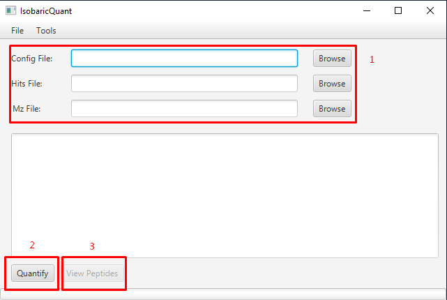
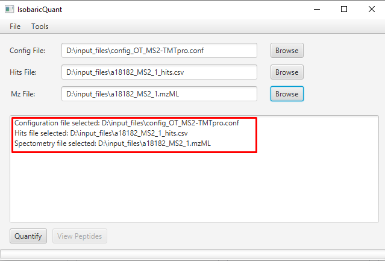
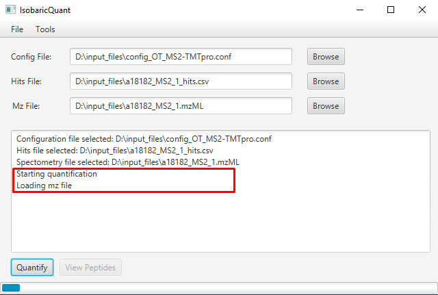
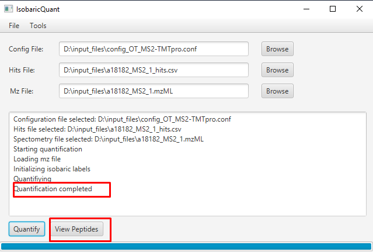
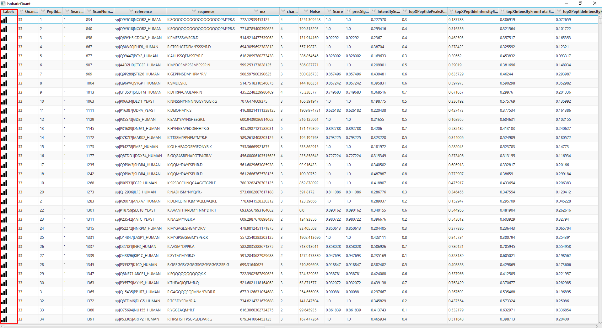
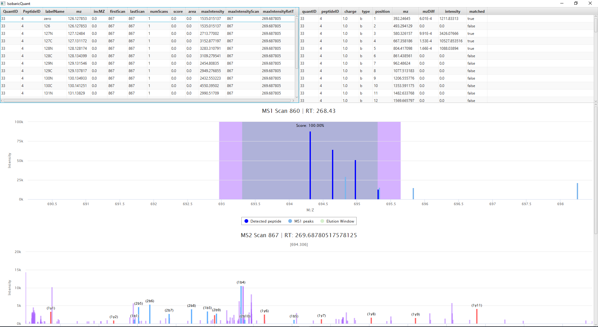
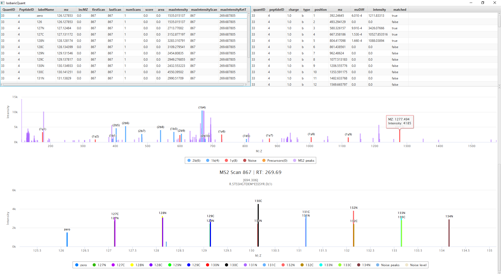

.. toctree::
   :maxdepth: 2
   :caption: Preface

Introduction
===============

IsobaricQuant, a Java-based software tool for the quantification, visualization, and filtering of isobarically-labeled peptides. IsobaricQuant is a cross-platform standalone tool that can be operated via an intuitive graphical user interface (GUI), or integrated into custom pipelines via command line.

For input, it requires the mzML file of the MS run, a CSV file containing peptide spectral matches (PSM) obtained from a search engine, and a user-supplied text configuration file. Optionally, isotopic impurity correction can be performed using a reporter ion isotopic distribution CSV file. IsobaricQuant supports MS2 and MS3 level reporter ion quantification for iTRAQ up to 8-plex, TMT up to 11-plex and TMTpro up to 16-plex.

An integrated viewer allows visual inspection of isolation window purity in MS1 scans, reporter ion quantification, and fragment ion assignment. For MS3 acquisition methods, it further enables visual assessment of SPS ion selection.

Getting started
===============

Dependencies
------------

In order to run ``IsobaricQuant`` Java 17 is needed, first of all make sure you don't have the correct version installed already with the following command:

::

    java --version

If you don't have Java 17 installed follow the official instructions on how to install Java 17 for your platform:

Microsoft Windows
~~~~~~~~~~~~~~~~~

`Installation of the JDK on Microsoft Windows Platforms: <https://docs.oracle.com/en/java/javase/17/install/installation-jdk-microsoft-windows-platforms.html>`__ Instructions include steps to install the JDK on 64-bit Microsoft Windows operating systems.

Linux
~~~~~

`Installation of the JDK on Linux Platforms: <https://docs.oracle.com/en/java/javase/17/install/installation-jdk-linux-platforms.html>`__ Instructions include installation from Archive files and Red Hat Package Manager (RPM).

macOS
~~~~~

`Installation of the JDK on macOS: <https://docs.oracle.com/en/java/javase/17/install/installation-jdk-macos.html>`__ Instructions include steps to install the JDK on the macOS platform.

Installation
------------

Since IsobaricQuant is a java application, its installation is straightforward, first you need to download the jar file for your platform:

* `Windows <https://github.com/Villen-Lab/isobaricquant/releases/download/v1.0.1/IsobaricQuant_WIN.jar>`__
* `MacOS <https://github.com/Villen-Lab/isobaricquant/releases/download/v1.0.1/IsobaricQuant_MACOS.jar>`__
* `Linux <https://github.com/Villen-Lab/isobaricquant/releases/download/v1.0.1/IsobaricQuant_LINUX.jar>`__

Once the jar file is downloaded, place it in a folder of your choice, open a terminal and navigate to the jar file location. That's it!

How to run IsobaricQuant?
-------------------------

After downloading the jar file, ``IsobaricQuant`` can be used via GUI:

::

    java --add-opens java.base/java.lang=ALL-UNNAMED -jar IsobaricQuant.jar

Or it can be used via command line:

::

    java -jar IsobaricQuant.jar -c <config_file> -mzf <mz_file> -h <hits_file> -o <output_folder>

Input/Output Files
-------------------------

The input and output files are the same for the GUI and CLI mode, the required input files are:

Configuration file
~~~~~~~~~~~~~~~~~~

::

    {
        "generateFragmentIonsFile": true,
        "ms2NoiseWindowTolerance": 1,
        "searchFragmentWIndowTolerance": 1.5,
        "isoMethod": "TMTpro",
        "confLabels": "all",
        "PPMTolerance": 20,
        "MS1PPMTolerance": 20,
        "MS2PPMTolerance": 20,
        "massType": "HCD_FRAGMENTATION",
        "scanLevel": 2,
        "scoreType": "ISOTOPE_DISTRIBUTION",
        "ms1PrecWindowDaltons": 0.35,
        "neutralLossesFI": "63.98,18.01,17.03",
        "neutralLosses": "63.98,18.01,17.03",
        "topXNum": 10,
        "ms1DepthSearch": 5,
        "recalcIntensities": false,
        "dataSheetName": "TMT11_TL277832",
        "modifications": {
            "varMods": "15.9949146202 M 42.01056468472 n",
            "consMods": "pep_n 304.2071453165, C 57.02146372118, K 304.2071453165",
            "varTermParams": ""
        },
        "mzFilePath": "",
        "hitImpurity": "master_scan",
        "searchMethod": "most_intense"
    }

Parameter description

| **isoMethod:** Isobaric Methods
| **Values:**
  iTRAQ4plex,iTRAQ8plex,TMTDuplex,TMT6plex,TMT10plex,TMT11plex,TMTpro
| **Default:** iTRAQ4plex

| **massType:** mass type
| **Values:** HCD fragmentation,Neutral mass
| **Default:** HCD fragmentation

| **scanLevel:** Scan level for isobaric quantification
| **Values:** MS2,MS3
| **Default:** MS2

| **scoreType:** Score calculation
| **Values:**
| Isotope distribution: peptide isotopes intensity/total intensity in
  isotopes window.
| Reporters intensity: reporters intensity/total intensity in window.
| Reporters found: num. reporters found/num. Reporters
| **Default:** Reporters intensity

| **confLabels:** Labels to be searched in (use comma separated
  values. ex: 114,115,116,117). Write ‘all’ to search all of them. For
  TMT10plex, use label reagent: 126,127N,127C,128N,128C…
| **Values:** input by user
| **Default:** all

| **recalcIntensities:** If activated, it will
  recalculate intensities using the product data sheet.
| **Default:** not activated

| **dataSheetName:** Product data sheet
| **Values:** TMT10plex_QI218066,TMT11_TL277832
| **Default:** TMT10plex_QI218066

| **PPMTolerance:** PPM Tolerance for MS3
| **Values:** input by user
| **Default:** 10

| **MS1PPMTolerance:** PPM Tolerance for MS1
| **Values:** input by user
| **Default:** 10

| **MS2PPMTolerance:** PPM Tolerance for MS2
| **Values:** input by user
| **Default:** 1000

| **ms1PrecWindowDaltons:** Dalton window that will
  be used to calculate the precursor signal percentage in the MS1 scan.
| **Values:** input by user
| **Default:** 1

| **searchFragmentWindowTolerance:** MS2
  precursor window (Da)
| **Values:** input by user
| **Default:** 2.5

| **generateFragmentIonsFile:** Generates a file
  with all peptides’ fragment ions.
| **Default:** not activated

| **hitImpurity:**
| **Values:** master_scan,weighted_avg
| The precursor signal is calculated using the weighted signal or signal
  percentage
| If it’s not weighted avg, then it will be
  ``precursor int / intensities`` in isolation window (calculated using
  ``ms1PrecWindowDaltons``)

::

   signalPerc = precIntensity / allIntensities

if it’s weighted, then it will calculate the same thing as the above but
for the current ms1, its previous ms1 and its posterior ms1. The result
is the weighted signal, calculated using the RT distance to the current
ms1

::

   (dPivotCurrent / totalDistances) * currentSignal + (dPivotPre / totalDistances) * preSignal + (dPivotPost / totalDistances) * postSignal

**Default:** master_scan

| **searchMethod:** Search method used to select a TMT
  reporter ion peak
| **Values:** most_intense, least_intense, lower_ppm_error
| **Default:** most_intense

| **ms1DepthSearch:** Number of MS1 scans depth to
  search for MS3 scans
| **Values:** input by user
| **Default:** 5

| **topXNum:** Top X most intense ions used to calculate scores
| **Values:** input by user
| **Default:** 10

| **neutralLosses:** Comma separated neutral loss masses (ex:
  97.977,97.995). The peak will be searched for these NL.
| **Values:** input by user, e.g. "63.98,18.01,17.03"

| **neutralLossesFI:** Comma separated neutral loss masses (ex:
  97.977,97.995). The fragment ions will be searched for these NL.
| **Values:** input by user, e.g. "63.98,18.01,17.03"

Mz File
~~~~~~~

mzML or mzXML input file. The instrument raw file can be converted from existing tools such as `msconvert <https://proteowizard.sourceforge.io/tools.shtml>`__.

Hits file
~~~~~~~~~

Comma separated values of the identified peptides. A conversion of the output file of a search algorithm such as `Comet <https://uwpr.github.io/Comet/>`__ is required.

The values are the following:

| **Search ID:** integer value to identify the search where the peptide was detected.
| **Peptide ID:** integer value that identifies the peptide
| **Sequence:** peptide sequence
| **Reference:** protein sequence reference
| **Charge:** peptide charge
| **Start Scan:** peptide MS2 Scan
| **M/Z:** peptide m/z

Once IsobaricQuant finishes the quantification an output folder will be created on the same folder where the IsobaricQuant jar file resides.

The output folder contains 4 csv files with the result of the quantification

isofrag.csv
~~~~~~~~~~~~~~~~~

File containing matching information for the peptide’s fragment ions

| **Peptide ID:** peptide id introduced in the input file
| **Quant ID:** quantification id (unused field at 0)
| **Fragment ion charge**
| **Fragment ion type (a, b…)**
| **Fragment ion position**
| **Fragment ion mz**
| **Fragment ion mz difference**
| **Fragment ion intensity**
| **Fragment ion matched (true or false)**

isolab.csv
~~~~~~~~~~~~~~~~

File containing the quantification data

| **Peptide ID:** peptide id introduced in the input file
| **Quant ID:** quantification id (unused field at 0)
| **Label ID:** string identificator of the label
| **Label MZ:** Matching peak MZ (theoretical if nothing matched)
| **MZ Variance:** mz variance between the theoretical mz and the matched mz (0 otherwise)
| **Scan:** matched scan number
| **Scan:** matched scan number (duplicated)
| **Number of scans:** 1 default value
| **Unused parameter:** 0 default value
| **Unused parameter:** 0 default value
| **Label intensity:** Matching peak intensity (0 otherwise)
| **MS2 Scan:** MS2 scan introduced in the input file
| **Retention Time:** matched scan retention time

isopep.csv
~~~~~~~~~~~~~~~~

File containing the basic information to be used to match the results with the other files

| **Quant ID:** quantification id (unused field at 0)
| **Peptide ID:** peptide id introduced in the input file
| **Search ID:** search id introduced in the input file
| **MS2 Scan:** MS2 scan introduced in the input file
| **Noise:** Calculated noise in the scan
| **Score:** calculated score as specified in the configuration file (isotope distribution, reporters intensity or reporters found)

isopep_extra.csv
~~~~~~~~~~~~~~~~~~~~~~

File containing the quantification scores. Please, check the scores description for further information.

| **Peptide ID:** peptide id introduced in the input file
| **Quant ID:** quantification id (unused field at 0)
| **Precursor signal**
| **PeptideIntensityScore**
| **MS2 TopXPeptidePeaksRatio**
| **MS2 PeptideTopXIntensityScore**
| **MS2 TopXIntensityFromTotalScore**
| **MS2 PeptideTopXIntensityFromTotalScore**
| **MS2 TopPeakIntensityScore**
| **MS2 isTopPeakFromPeptide:** 1 (yes), 0 (no)
| **MS2 isTopPeakFromPeptideNeutralLoss():** 1 (yes), 0 (no)
| **MS2 TopPeakIntensityTopXScore()**
| **MS2 TopPeakMass**
| **msnTotalSignal**
| **precTPIntRatio**
| **precRepIntRatio**
| **precRepIntRatio**
| **precTotalSignal**
| **totalSignalSPSWind**
| **Scan level:** 2 or 3
| **MS1 scan number:** 0 if not found
| **MS2 scan number**
| **MS3 scan number:** 0 if not found or the selected level was 2
| **MS1 retention time:** 0 if not found
| **MS2 retention time**
| **MS3 retention time:** 0 if not found or the selected level was 2
| **SPS masses:** their mz separated by ;

IsobaricQuant CLI mode
~~~~~~~~~~~~~~~~~~~~~~

::

    java -jar IsobaricQuant.jar -c <config_file> -mzf <mz_file> -h <hits_file> -o <output_folder>

The CLI mode doesn't include a viewer, as soon as the command is executed the quantification starts, once is completed an output folder is generated with all the output files detailed in the previous section. The generated files can be opened using the GUI version at any time. The CLI version will allow the user to include IsobaricQuant in any pipeline

IsobaricQuant GUI mode
~~~~~~~~~~~~~~~~~~~~~~

On the GUI mode you will find a window with some options:

1. Select the input files, for more information about input files refer to the ``Input/Output Files`` section
2. Once all the files have been selected preceed with the quantification using the Quantify button
3. When the quantification is completed you can proceed to consult the peptide information

In the log window you can check if the path of the selected files is correct:

Once you click the Quantify button, the quantification will start, indicating the steps involved on the process:

When the quantification is done, an output folder is created with the quantification information. The GUI includes a viewer, that will allow the user to view the quantification matching information including fragment ions

Test files
==========

Once IsobaricQuant is ready to run, you can use the following input and output sample files to test the jar and its dependencies are working properly

`Input files <https://drive.google.com/drive/folders/1jEFNR-CN1hSt8sFS30PR12yAxKy9uz_p?usp=sharing>`__

`Output files <https://drive.google.com/drive/folders/1-QG8xnBa9Vejj2Ujjh405bWw8-BSJdKx?usp=sharing>`__

Algorithm
=========

.. container::

   For every peptide hit of the input file submitted, we get the
   corresponding scan (MS2 or MS3 depending on scan level requested) and
   search for every label the nearest peak to their mz applying a window
   (+/- PPMTolerance). The peak selection is done using the
   [searchMethod] indicated by the user.

   If the user selected the option to recalculate the intensities based
   on the datasheet provided, then it will recalculate them using the
   corresponding equation matrix with the observed intensities. If we
   haven’t obtained enough data to solve the matrix, then it will use
   the observed intensities instead.

Noise
=====

.. container::

   Removes the intensities from the peaks of the scan that are within
   the labels (low and high mz), and the noise is the average of the
   remaining peaks intensities. The noise is calculated by obtaining all
   the intensities within the lowest mz label (- PPMTolerance applied) -
   1, and the highest one (+ PPMTolerance applied) + 1, and then
   removing the observed intensities of the labels. The noise will be
   the average of these intensities.

MSN Scores
==========

ScoreType.ISOTOPE_DISTRIBUTION
------------------------------

.. container::

   Gets the precursor for the scan, and calculates a mz window based on
   ppm tolerance for MS1 and +/- 1. This window is used to calculate the
   isotopic distribution (mzs). For all peaks in the scan, the
   intensities are accumulated in 2 different groups: isobIntensities
   for all the intensities of peaks that are within the isotopic
   distribution peaks, and nonIsobIntensities for the ones that are not
   in the distribution.

The score is calculated as:

::

   score = isobIntensities/(isobIntensities + nonIsobIntensities)

ScoreType.REPORTERS_INTENSITY
-----------------------------

.. container::

   Gets the higher and lower mz from all the labels and for every peak
   of the scan (MS2 or MS3), accumulates the intensities that are within
   this range (labels range).

Using the isobaric intensities of the labels, the score is calculated
as:

::

   score = isobIntensities/allIntensities

ScoreType.REPORTERS_FOUND
-------------------------

.. container::

   Counts how many of the isobaric labels are within the scan peaks
   (using MS2 or MS3 tolerance), and calculates the score as:

::

   cnt/isoLabels.size()

Precursor signal percentage
---------------------------

.. container::

   Intensity of the precursor percentage from the total intensity in a
   given window (MS1). Gets the precursor intensity using the mz +/-
   MS1PPMTolerance. We limit the mz window to search for intensities by
   using the lowest precursor mz - ms1 window in Da and the highest +
   window in Da.

|  Accumulates all peaks intensities within the specified mz window of
  the MS1 scan.
|  Calculates the signal as:

::

   signalPerc = precIntensity/allIntensities

Precursor weighted signal
-------------------------

.. container::

   Using the previous MS1 scan to the precursor’s, the precursor’s MS1,
   and the posterior one. We calculate the retention time of each scan
   and then the total distance between the scans as: Precursor’s
   retention time + Distance between previous MS1 and precursor’s +
   distance between precursor’s and posterior MS1. For each of these 3
   scans we calculate the precursor signal percentage so that the
   weighted score can be calculated as:

::

   (dPivotCurrent / totalDistances) * currentSignal + (dPivotPre / totalDistances) * preSignal + (dPivotPost / totalDistances) * postSignal

MS2 scores
==========

All MS2 scores are calculated by matching the BY fragment ions of the
peptide to their most similar peak. (BY Fragment ions for the peptide,
BY fragment ions for the peptide with neutral loss applied (calc all
fragment ions for peptide mass - neutral mass loss
[neutralLossesForFragmentIons]), and neutral losses specified
[neutralLosses]) From the peak list we are excluding the MS1 precursor,
the reporter ions, and the complement ions.

**top X:** top x peaks with highest intensity.

Peptide Intensity Score
-----------------------

From Scan peaks, sum of intensities of fragment ions divided by total.

::

   score = totalFragmIonsIntensity/totalIntensity

Top X Peptides Peaks Ratio Top X defined by user Number of fragment ions
in top X divided by top X topXFIons/topXNum

Peptide Top X Intensity Score
-----------------------------

Sum of intensities of fragment ions in top X divided by the total sum of
intensities of top X.

::

   score = topXFragmIonsIntensity/topXIntensity

Top X Intensity From Total Score
--------------------------------

Sum of intensities in top X divided by the sum of all peaks’
intensities.

::

   score = topXIntensity/totalIntensity

Peptide Top X Intensity From Total Score
----------------------------------------

Sum of intensities of fragment ions in top X divided by the sum of all
peaks’ intensities.

::

   score = topXFragmIonsIntensity/totalIntensity

Top Peak Intensity Score
------------------------

Higher intensity divided by the sum of all peaks’ intensities.

::

   score = topPeakIntensity/totalIntensity

Top Peak Intensity Top X Score
------------------------------

Highest intensity divided by the total sum of intensities of top X.

::

   score = topPeakIntensity/topXIntensity

Top Peak From Peptide
---------------------

Indicates if the top peak (most intense) is a fragment ion

Top Peak From Peptide Neutral Loss
----------------------------------

Indicates if the top peak (most intense) is a neutral loss

Top Peak Mass
-------------

Mass of the top peak (most intense)

msnTotalSignal
--------------

Sum of all the isobaric quant intensities (found labels)

precTotalSignal
---------------

Sum of precursor intensities found in MS2 (low and high mz is calculated
using MS2PPMTolerance)

totalSignalSPSWind
------------------

Sum of precursors intensities found in MS2 within a window of mz, this
window is calculated as follows:

::

   mz +/- ms2PrecursorWindowTolerance(mz)

precTPIntRatio
--------------

::

   score = precTotalSignal/totalSignalSPSWind

precRepIntRatio
---------------

::

   matchingBYInt = matching B and Y fragment ions (from the SPS list) intensities
   score = matchingBYInt / totalSignalSPSWind

precTPNumRatio
--------------

numPeaksSPSWind = number of peaks found in MS2 within a window of mz,
this window is calculated as follows:

::

   mz +/- ms2PrecursorWindowTolerance(mz)
   score = number of precursors found / numPeaksSPSWind

MS3 scores
==========

MSN Total signal
----------------

Sum of all label intensities found in the scan (level defined in the
conf file) The peak is found within a window (PPMTolerance)

Precursors
~~~~~~~~~~

List of precursors provided by the scan minus their parent scan
precursors MS3 <- we are removing the precursors that are within the MS2
and MS1 MS2 <- we are removing the precursors that are within the MS1

Precursors intensities
~~~~~~~~~~~~~~~~~~~~~~

We are obtaining the intensities of the MS3 precursors in the MS2 (peak
selection using MS2PPMTolerance window)

Precursor total signal
----------------------

Sum of precursors intensities

Precursors window intensities
-----------------------------

| For every MS3 precursor we are obtaining all intensities within the
  window defined by
| ``lowMz = (Precursor mz - tolerance)`` with ``MS2PPMTolerance``
| ``highMz = (Precursor mz + tolerance)`` with ``MS2PPMTolerance``
| Where tolerance is the conversion from ``ms2PrecursorWindowTolerance``
  mass to ``m/z`` using the peptide charge (**search hit!**)

Total signal SPS window
-----------------------

Sum of precursors window intensities

.. _prectpintratio-1:

precTPIntRatio
--------------

Precursor total signal divided by total signal sps window

Peptide Fragment ions
~~~~~~~~~~~~~~~~~~~~~

B and Y fragment ions for the peptide (search hit) matching MS2 peaks.

Precursors matching BY intensities
~~~~~~~~~~~~~~~~~~~~~~~~~~~~~~~~~~

Using the fragment ions calculated for the peptide (search hit). Sum of
all fragment ions intensities that their mz is found within any of the
precursors windows (using ``MS2PPMTolerance``)

.. _precrepintratio-1:

precRepIntRatio
---------------

Precursors matching BY intensities divided by total signal SPS window

.. _prectpnumratio-1:

precTPNumRatio
--------------

Number of MS3 precursors found in MS2 divided by number of peaks found
in their windows.